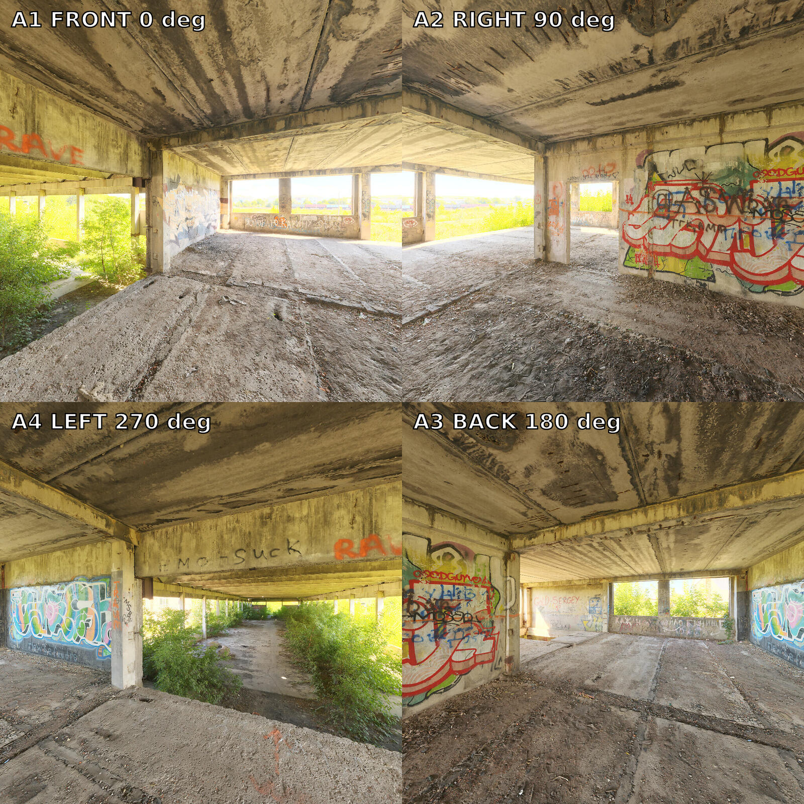
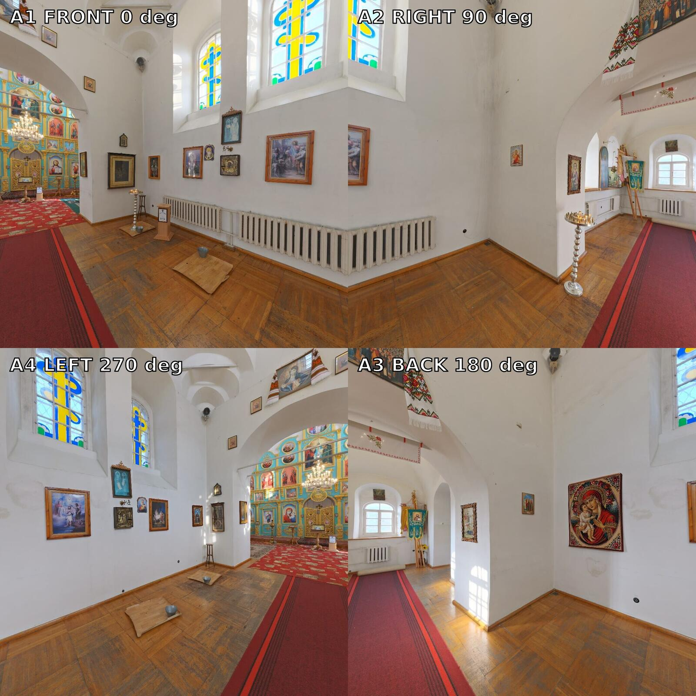
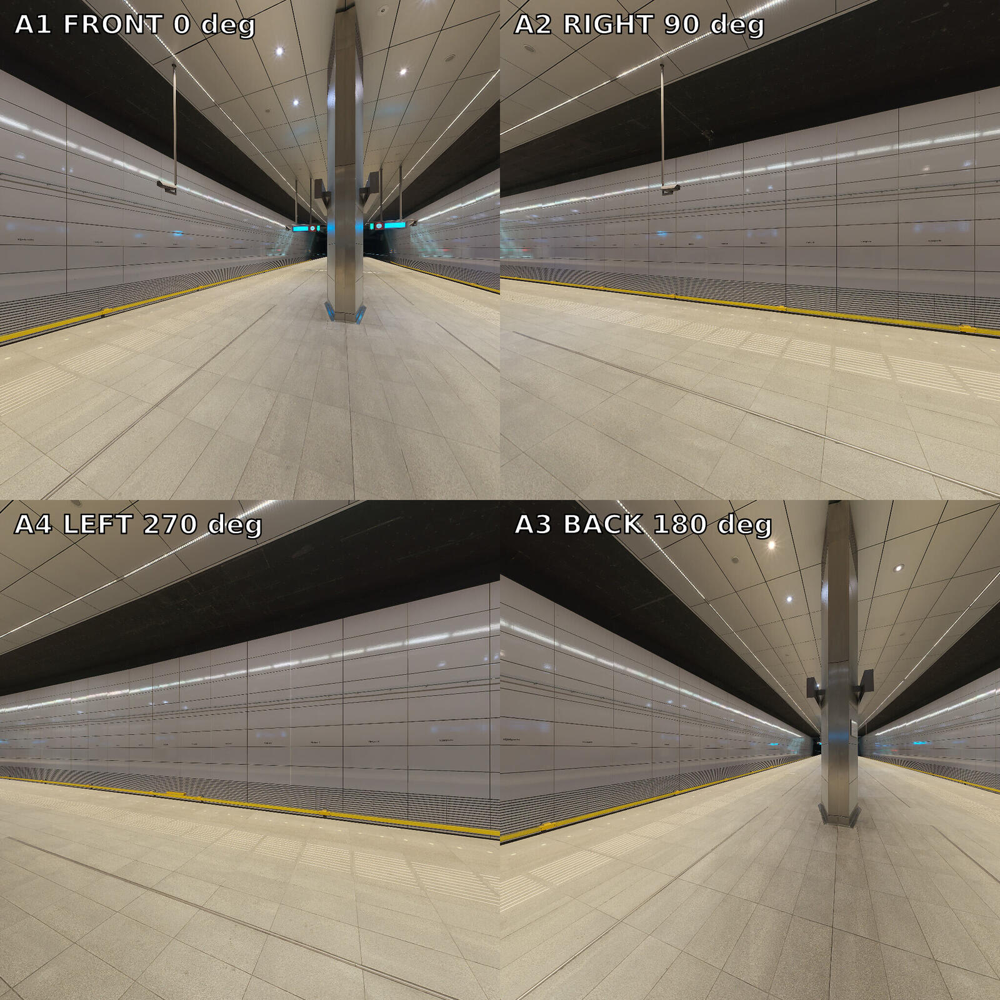

# H3 World Reference Starter Pack

Three CC0 environment packs prepared for MiniMax H3 reference-conditioning tests. Each scene contains four clean, ordered perspective images, one labeled 2×2 fallback atlas, and the downsampled equirectangular source panorama.

The first deeper experiment is now ready under [`abandoned_workshop_02/orbit7_pilot/`](abandoned_workshop_02/orbit7_pilot/README.md): an H1–H7 full-loop sequence, 15-second/362-frame timing map, clean and removable-label variants, continuous motion reference, prompt, captions, and an executable task brief for a Comfy agent.

> This is a **reference-conditioning and evaluation dataset**, not a Gaussian-splat training set. Every view rotates around one camera center, so the pack has no translated-camera parallax.

## Preview

| Abandoned Workshop 02 | Small Cathedral | Metro: Vijzelgracht |
|---|---|---|
|  |  |  |

These scenes deliberately stress different failure modes:

- `abandoned_workshop_02`: irregular openings, foliage, graffiti, and damaged geometry;
- `small_cathedral`: many persistent landmarks, framed art, windows, and strong color anchors;
- `metro_vijzelgracht`: symmetry, repetition, long lines, and relatively few unique landmarks.

## Layout

```text
h3-reference-starter/
  manifest.json
  PROMPT_TEMPLATE.md
  SHA256SUMS
  build_reference_pack.sh
  <scene_id>/
    A1_front_yaw000.jpg
    A2_right_yaw090.jpg
    A3_back_yaw180.jpg
    A4_left_yaw270.jpg
    atlas_2x2_clockwise.jpg
    source_pano_2048x1024.jpg
```

## Recommended H3 test

1. Start with one scene and upload `A1`, `A2`, `A3`, and `A4` as four separate reference images in that exact order.
2. Use `PROMPT_TEMPLATE.md`, replacing the scene description with the chosen environment.
3. Generate one five-second Ref2VA clip with `ref_image_size=max`.
4. Repeat with only `atlas_2x2_clockwise.jpg` and the atlas prompt.
5. Keep seed, prompt, duration, resolution, steps, and camera instruction fixed. Compare landmark retention, topology, scene morphing, and camera adherence.

For the longer H1–H7 experiment, use the Orbit-7 pilot. H7 intentionally duplicates H1 as a loop-closing endpoint. The preferred path uses clean images with `MiniMaxH3AddGuide`; the labeled slideshow is an ablation rather than the default.

The images are cardinal views with a 100° horizontal and vertical field of view. Adjacent centers are 90° apart, giving 10° of image overlap. This intentionally creates a simple full-360 baseline. For the next route-focused experiment, derive additional 45° or 60° views from `source_pano_2048x1024.jpg`, or capture translated views in Unreal.

## Derivation

- Source: Poly Haven's official tone-mapped equirectangular JPEG.
- Source panorama retained here: 2048×1024 JPEG.
- Perspective views: 1024×1024 JPEG, rectilinear, pitch 0°, yaw 0°/90°/180°/270°, 100° horizontal and vertical FOV.
- Atlas: 1600×1600 JPEG; A1 top-left, A2 top-right, A4 bottom-left, A3 bottom-right. Reading clockwise gives A1 → A2 → A3 → A4.
- Tooling: `ffmpeg` `v360` plus ImageMagick `convert`; exact reproduction lives in `build_reference_pack.sh`.

## License and provenance

All media in this folder are derivatives of Poly Haven assets released under [CC0 1.0](https://polyhaven.com/license). Attribution is not required, but provenance is preserved so every image can be audited and regenerated.

| Scene | Official asset page | Original tone-mapped JPEG MD5 |
|---|---|---|
| Abandoned Workshop 02 | https://polyhaven.com/a/abandoned_workshop_02 | `df639e9a3e30683bf4dabc13e1ab4ebc` |
| Small Cathedral | https://polyhaven.com/a/small_cathedral | `c9cdbd6165bc232a4dd54cd82bbe69c2` |
| Metro: Vijzelgracht | https://polyhaven.com/a/metro_vijzelgracht | `3d21570ca2502e85b72a467b8372403e` |

The CC0 statement applies to the media derivatives in this dataset folder. It does not change the licensing of unrelated repository content.

## What this pack can and cannot prove

It can test whether H3 understands multiple views as one persistent world, whether separate files outperform one contact sheet, and which scene structures drift most.

It cannot train or validate a Gaussian splat by itself. Splat reconstruction needs translated camera centers, known poses, and parallax. Use the Unreal capture plan in `../../research/UNREAL_SPLAT_DATASET_FORGE.md` for that stage.
