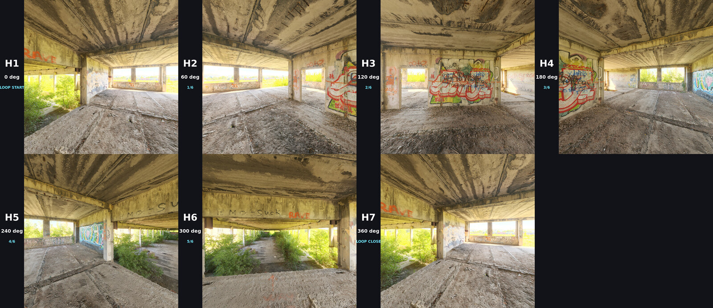

# Orbit-7 H1–H7 Pilot

This pilot converts one CC0 panorama into seven ordered world anchors for a complete clockwise loop:

| Slot | Yaw | Meaning |
|---|---:|---|
| H1 | 0° | loop start / hero view |
| H2 | 60° | clockwise step 1 |
| H3 | 120° | clockwise step 2 |
| H4 | 180° | opposite view |
| H5 | 240° | clockwise step 4 |
| H6 | 300° | clockwise step 5 |
| H7 | 360° | exact visual return to H1 / loop closure |



## The important design choice

Use the files under `clean/` for real generation. They contain no baked labels. Use the `labeled/` copies for debugging, dataset inspection, and the slideshow ablation only.

The label is placed in a separate 160-pixel strip on the left, never over the source image. It can therefore be removed deterministically by cropping 160 pixels from the left; no inpainting is needed. This avoids teaching H3 to paint random H-numbers onto walls like a confused maintenance droid.

## Best first run: AddGuide

For a 15-second native H3 generation, use seven chained `MiniMaxH3AddGuide` nodes with the clean images and these frame indices:

```text
H1 =   0
H2 =  60
H3 = 120
H4 = 181
H5 = 241
H6 = 301
H7 = 361
```

H3 uses a `17k + 5` frame grid at 24 fps. A nominal 15-second request becomes 362 frames. `timeline.json` also includes schedules for the 121-frame concept, native 5-second/124-frame, and native 10-second/243-frame tests.

## Second run: Ref2VA with separated appearance and motion

- Connect `clean/H1` through `clean/H7` as `<Picture 1>` through `<Picture 7>`.
- Connect `motion_ref_continuous_sweep_15s_362f_512.mp4` as `<Video 1>`.
- Use `H3_PROMPT.md`.
- The seven pictures define world identity and geometry.
- The video defines clockwise camera timing only.

Start with the normal 20-step Ref2VA sampler, `beta` scheduler, Turbo disabled, and a low-cost preview resolution. Raise quality only after the topology survives the full loop.

## Third run: labeled slideshow ablation

`debug_slideshow_H1-H7_15s_362f.mp4` presents the labeled slots in order. Treat this as an experiment, not the preferred motion reference. Hard scene changes can teach H3 to cut or morph instead of move through one fixed world.

## Caption rule for future training

Every future scene must reuse the exact same slot vocabulary and yaw semantics. The sidecar files under `captions/` are the canonical format:

```text
worldweaver_orbit7 slot=H3 yaw=120deg phase=2/6 direction=clockwise environment=fixed camera_center=fixed
```

Do not train an Orbit-7 LoRA from this single scene. First validate inference, then build at least a small multi-scene pack with the identical rig. This pilot tests the language and timeline before expensive training.
